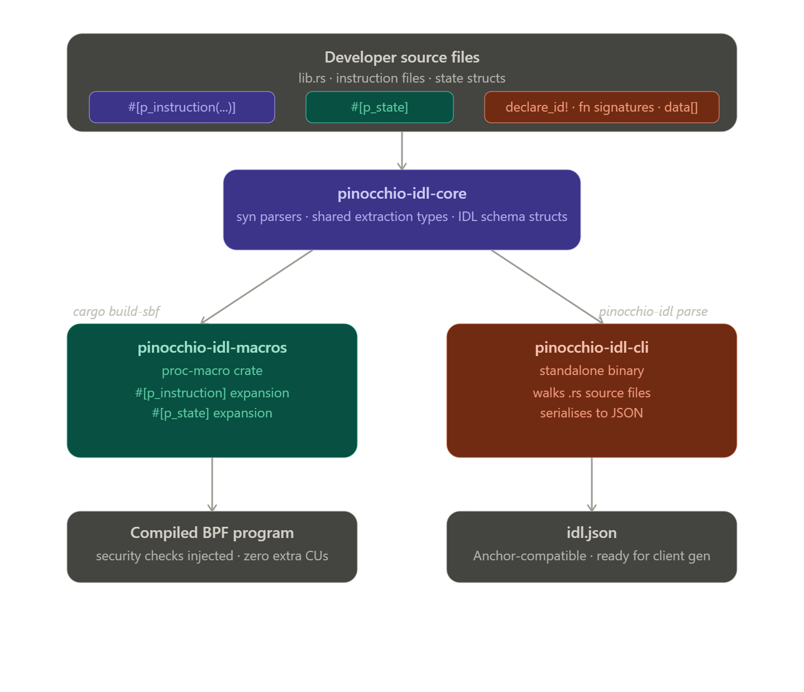

# pinocchio-idl

**IDL generation tooling for [Pinocchio](https://github.com/febo/pinocchio) Solana programs.**

`pinocchio-idl` brings IDL generation to the Pinocchio ecosystem — **no Anchor, no framework wrappers, zero runtime overhead.** Annotate your Pinocchio instruction handlers and account state structs with two proc-macro attributes, run one CLI command, and get a fully-structured `idl.json` that is compatible with both the [Anchor IDL spec](https://www.anchor-lang.com/) and [Codama](https://github.com/codama-idl/codama).

The macros do double duty: they **generate IDL metadata** _and_ **auto-inject security validation** (account-count bounds checks, signer/writable guards) directly into your instruction handlers **at compile time** — so you get correctness enforcement with no runtime cost and no framework in your dependency tree.


---

## Features

- **Compile-time security injection** — `#[p_instruction]` rewrites your handler at compile time to inject account-count bounds checking, per-account `signer`/`writable` guards, and **PDA on-chain verification** via `pinocchio_pubkey::derive_address`. No runtime framework, no trait vtables, just the checks you declared.
- **`#[p_instruction(...)]`** — Declare accounts (writable, signer, PDA seeds, relations, fixed addresses) and instruction data (byte-slice extraction) in a concise attribute DSL.
- **`#[p_state]`** — Derive a compile-time `SPACE` constant and an Anchor-compatible 8-byte `DISCRIMINATOR` (SHA-256 of `"account:<StructName>"`) for any account state struct. Supported field types include primitives, `Pubkey`, fixed-size arrays, `Vec<T>`, and `Option<T>`.
- **`#[p_error]`** — Annotate an error enum to have all its variants automatically emitted into the `errors` section of the IDL, with human-readable messages taken from doc comments and optional `#[p_code = N]` overrides.
- **`#[p_constant]`** — Annotate any `const` item to have its name, type, and value emitted into the `constants` section of the IDL.
- **Anchor + Codama compatible IDL** — The generated `idl.json` satisfies the Anchor IDL spec and is directly consumable by [Codama](https://github.com/codama-idl/codama) for client generation.
- **Zero runtime overhead** — All macro expansion happens at Rust compile time. The CLI is a pure static-analysis tool that never invokes the compiler.
- **Zero framework wrappers** — No Anchor, no additional runtime traits or abstractions. Your Pinocchio program stays exactly as lean as you wrote it.

---

## Workspace Layout

```
pinocchio-idl/
├── crates/
│   ├── pinocchio-idl-core/      # Shared parsing types & IDL structs
│   ├── pinocchio-idl-macros/    # Proc-macro crate (#[p_instruction], #[p_state])
│   ├── pinocchio-idl-cli/       # CLI binary (pinocchio-idl build)
│   └── fixtures/
│       └── escrow-fixture/      # Example Pinocchio program using the macros
└── Cargo.toml                   # Workspace root
```


---

## Architecture Diagram





---

## Installation

### CLI — `pinocchio-idl build`

Install the binary directly from GitHub (no crates.io required):

```bash
cargo install --git https://github.com/DivineUX23/pinocchio-idl.git pinocchio-idl-cli
```

Cargo will clone the repo, compile the `pinocchio-idl-cli` crate, and place the `pinocchio-idl` binary on your `PATH`.

Verify the install:

```bash
pinocchio-idl --version
```

---

## Usage

### 1. Add the macro dependency to your Pinocchio program

In your program's `Cargo.toml`, point directly at this GitHub repository:

```toml
[dependencies]
pinocchio-idl-macros = { git = "https://github.com/DivineUX23/pinocchio-idl.git" }
```

To pin to a specific branch or commit for reproducible builds:

```toml
pinocchio-idl-macros = { git = "https://github.com/DivineUX23/pinocchio-idl.git", branch = "main" }
# or
pinocchio-idl-macros = { git = "https://github.com/DivineUX23/pinocchio-idl.git", rev = "<commit-sha>" }
```

---

### 2. Annotate your program

#### `#[p_state]` — Account state struct

Decorate any named-field struct to get a compile-time `SPACE` constant and an Anchor-compatible `DISCRIMINATOR`:

```rust
use pinocchio_idl_macros::p_state;

#[p_state]
pub struct Escrow {
    pub seed:    u64,
    pub maker:   Pubkey,
    pub mint_a:  Pubkey,
    pub mint_b:  Pubkey,
    pub receive: u64,
    pub bump:    u8,
}
```

This expands to:

```rust
impl Escrow {
    pub const SPACE: usize = 8 + 32 + 32 + 32 + 8 + 1; // raw field bytes
    pub const DISCRIMINATOR: [u8; 8] = [/* sha256("account:Escrow")[..8] */];
}
```

Supported field types:

| Type | IDL type | `SPACE` bytes |
|---|---|---|
| `u8`, `i8`, `bool` | `u8` / `i8` / `bool` | 1 |
| `u16`, `i16` | `u16` / `i16` | 2 |
| `u32`, `i32` | `u32` / `i32` | 4 |
| `u64`, `i64` | `u64` / `i64` | 8 |
| `u128`, `i128` | `u128` / `i128` | 16 |
| `Pubkey` / `Address` | `pubkey` | 32 |
| `[u8; 32]` | `pubkey` | 32 |
| `[T; N]` | `[T; N]` | elem × N |
| `Vec<T>` | `vec<T>` | 4 (length prefix only) |
| `Option<T>` | `option<T>` | 1 + size(T) |
| Custom enum / struct | name as-is | error — use a primitive wrapper |

---

#### `#[p_instruction(...)]` — Instruction handler

Annotate your handler function to declare its accounts and data layout:

```rust
use pinocchio_idl_macros::p_instruction;

#[p_instruction(
    id = 0,
    accounts = [
        maker(signer, mut),
        escrow(mut, pda = ["escrow", maker, seed], state = Escrow),
        vault(mut, relations = [escrow, mint_a]),
        token_program(address = "TokenkegQfeZyiNwAJbNbGKPFXCWuBvf9Ss623VQ5DA")
    ],
    data = [
        seed:    u64 = data[0..8],
        receive: u64 = data[8..16],
        bump:    u8  = data[16]
    ]
)]
pub fn process_make_instruction(accounts: &[AccountView], data: &[u8]) -> ProgramResult {
    let [maker, mint_a, mint_b, escrow, vault, token_program] = accounts else {
        return Err(ProgramError::NotEnoughAccountKeys)
    };
    // ... your logic
    Ok(())
}
```

**Account constraint reference:**

| Constraint | Syntax | Effect |
|---|---|---|
| Writable | `mut` | Validates `account.is_writable()` at runtime |
| Signer | `signer` | Validates `account.is_signer()` at runtime |
| PDA seeds | `pda = ["literal", account_name, arg_name]` | Recorded in IDL **and** verified on-chain via `pinocchio_pubkey::derive_address` |
| Linked state | `state = StructName` | Associates an account with its `#[p_state]` type |
| Fixed address | `address = "Base58..."` | Records a known program/sysvar address in the IDL |
| Relations | `relations = [other, another]` | Records account relationships in the IDL |

**Data field syntax:** `field_name: Type = data[start..end]` or `data[index]`

#### What the macro injects at compile time

When the Rust compiler expands `#[p_instruction]`, it **rewrites your function body** to prepend the following guards — no boilerplate you have to write:

```rust
// 1. Bounds check — inserted at the very top of the function
if accounts.len() < 4 {   // number of declared accounts
    return Err(ProgramError::NotEnoughAccountKeys);
}

// 2. Per-account constraint guards — inserted after your account bindings
if !maker.is_signer() {
    return Err(ProgramError::MissingRequiredSignature);
}
if !escrow.is_writable() {
    return Err(ProgramError::MissingRequiredSignature);
}
// ...and so on for every declared constraint
```

All of this happens at **compile time** with zero runtime overhead and without any framework in your dependency tree — you just annotate your function and the macro handles the rest.

---

#### `#[p_error]` — Program error enum

Annotate an error enum so all its variants are emitted into the `errors` section of the IDL. Use standard Rust doc comments (`///`) as the human-readable message, and the optional `#[p_code = N]` attribute to override the default 0-based error code:

```rust
use pinocchio_idl_macros::p_error;

#[p_error]
pub enum EscrowError {
    /// The escrow has already been taken
    AlreadyTaken,          // code 0
    /// The offer amount is zero
    ZeroAmount,            // code 1
    #[p_code = 100]
    /// Invalid mint provided
    InvalidMint,           // code 100
    /// The escrow has expired
    Expired,               // code 3
}
```

- `#[p_code = N]` overrides the sequential index for a single variant; other variants continue from their position index.
- `#[p_code]` is stripped at compile time by the macro, so rustc never sees an unknown attribute.
- Doc comments become the `msg` field in the IDL; the variant name is used as a fallback if no doc comment is present.

---

#### `#[p_constant]` — On-chain constant

Annotate any `const` item to have it appear in the `constants` section of the IDL:

```rust
use pinocchio_idl_macros::p_constant;

#[p_constant]
pub const MAX_ESCROW_DURATION: u64 = 60 * 60 * 24 * 30;  // 30 days in seconds

#[p_constant]
pub const ESCROW_VERSION: u8 = 1;
```

The CLI reads the constant's name, type, and value expression from the source AST and serialises them directly into the IDL.

---

### 3. Generate the IDL

From inside your Pinocchio program directory (where your `Cargo.toml` lives):

```bash
pinocchio-idl build
```

This produces `idl.json` in the current directory. Options:

```bash
pinocchio-idl build \
  --manifest-path path/to/Cargo.toml \   # default: ./Cargo.toml
  --out target/idl/my_program.idl.json   # default: ./idl.json
```

The generated file is a valid **Anchor-compatible IDL** and is also directly consumable by **[Codama](https://github.com/codama-idl/codama)** for automatic client-code generation in TypeScript, Rust, and other languages.

---

## Example: Escrow Program

A complete working example lives in [`crates/fixtures/escrow-fixture/src/lib.rs`](crates/fixtures/escrow-fixture/src/lib.rs):

```rust
use pinocchio::{
    AccountView, ProgramResult,
    error::ProgramError,
};
use pinocchio_idl_macros::{p_constant, p_error, p_instruction, p_state};

pinocchio::address::declare_id!("11111111111111111111111111111111111111111");

#[p_constant]
pub const ESCROW_VERSION: u8 = 1;

#[p_error]
pub enum EscrowError {
    /// The escrow has already been taken
    AlreadyTaken,
    /// The offer amount is zero
    ZeroAmount,
    #[p_code = 100]
    /// Invalid mint provided
    InvalidMint,
}

#[p_state]
pub struct Escrow {
    pub seed:      u64,
    pub maker:     [u8; 32],
    pub mint_a:    [u8; 32],
    pub mint_b:    [u8; 32],
    pub receive:   u64,
    pub bump:      u8,
    pub authority: Option<[u8; 32]>,  // Option<T> is now supported
}

#[p_instruction(
    id = 0,
    accounts = [
        maker(signer, mut),
        escrow(mut, pda = ["escrow", maker, seed], state = Escrow),
        vault(mut, relations = [escrow, mint_a]),
        token_program(address = "TokenkegQfeZyiNwAJbNbGKPFXCWuBvf9Ss623VQ5DA")
    ],
    data = [
        seed:    u64 = data[0..8],
        receive: u64 = data[8..16],
        bump:    u8  = data[16]
    ]
)]
pub fn process_make_instruction(accounts: &[AccountView], data: &[u8]) -> ProgramResult {
    let [maker, mint_a, mint_b, escrow, vault, token_program] = accounts else {
        return Err(ProgramError::NotEnoughAccountKeys)
    };
    Ok(())
}
```

---

## How it Works

```
Your Pinocchio source (.rs files)
        │
        ▼
  pinocchio-idl build
        │
        ├─ Walks all .rs files in src/
        ├─ Parses each file with `syn`
        ├─ Discovers #[p_instruction], #[p_state], #[p_error], #[p_constant] items
        ├─ Reads program name/version from Cargo.toml
        └─ Serializes to Anchor-compatible idl.json
```

The `#[p_instruction]` and `#[p_state]` macros work **independently** of the CLI — they expand at Rust compile time, injecting validation code into your handlers. The CLI is a pure static analysis tool that re-parses your source without invoking the Rust compiler.

---

## IDL Output Format

The generated `idl.json` follows the Anchor IDL spec and is also **Codama compatible**:

```json
{
  "address": "<your program id>",
  "metadata": {
    "name": "your-program",
    "version": "0.1.0",
    "spec": "0.1.0",
    "description": "..."
  },
  "instructions": [
    {
      "name": "process_make_instruction",
      "discriminator": [0],
      "accounts": [
        { "name": "maker", "writable": true, "signer": true },
        { "name": "escrow", "writable": true, "pdaSeeds": { "seeds": [...] } },
        ...
      ],
      "args": [
        { "name": "seed",    "type": "u64" },
        { "name": "receive", "type": "u64" },
        { "name": "bump",    "type": "u8"  }
      ]
    }
  ],
  "accounts": [ { "name": "Escrow", "discriminator": [...] } ],
  "types": [
    {
      "name": "Escrow",
      "type": {
        "kind": "struct",
        "fields": [
          { "name": "seed",      "type": "u64" },
          { "name": "maker",     "type": "pubkey" },
          { "name": "authority", "type": "option<pubkey>" }
        ]
      }
    }
  ],
  "errors": [
    { "code": 0,   "name": "AlreadyTaken", "msg": "The escrow has already been taken" },
    { "code": 1,   "name": "ZeroAmount",   "msg": "The offer amount is zero" },
    { "code": 100, "name": "InvalidMint",  "msg": "Invalid mint provided" }
  ],
  "constants": [
    { "name": "ESCROW_VERSION",     "type": "u8",  "value": "1" },
    { "name": "MAX_ESCROW_DURATION","type": "u64", "value": "60 * 60 * 24 * 30" }
  ]
}
```

---

## Building from Source

```bash
git clone https://github.com/DivineUX23/pinocchio-idl.git
cd pinocchio-idl
cargo build --workspace
```

Run the tests:

```bash
cargo test --workspace
```

---

## Limitations & Roadmap

This is a beta / capstone-phase project. The following known gaps exist:

### Current Limitations

| Area | Status |
|---|---|
| Pinocchio version > 0.10.0 | `AccountView` and updated PDA APIs from Pinocchio ≥ 0.11 are fully supported. Older pre-0.10 account types are not. |
| Multi-file module re-exports | The CLI walks `src/` recursively but only discovers items annotated directly with `#[p_instruction]` / `#[p_state]` / `#[p_error]` / `#[p_constant]` — items re-exported via `pub use` from external crates are not picked up. |
| No `cargo-pinocchio-idl` integration | Must be invoked as a standalone binary; no `cargo` subcommand plugin yet. |
| Enum / struct field types in `#[p_state]` | Custom enum or nested struct fields are not sized automatically. Use a primitive or `[u8; N]` wrapper, or size the account manually. |

### Roadmap

- [ ] Publish to crates.io
- [ ] `cargo pinocchio-idl` plugin
- [ ] Well-known program address auto-resolution (e.g. `TokenProgram` → `TokenkegQ...`, `SystemProgram` → `111...`, `AssociatedTokenProgram` → `ATokenGP...`)
- [ ] `p_parse!` declarative macro for inline account unpacking + data parsing + security guards in a single call-site macro